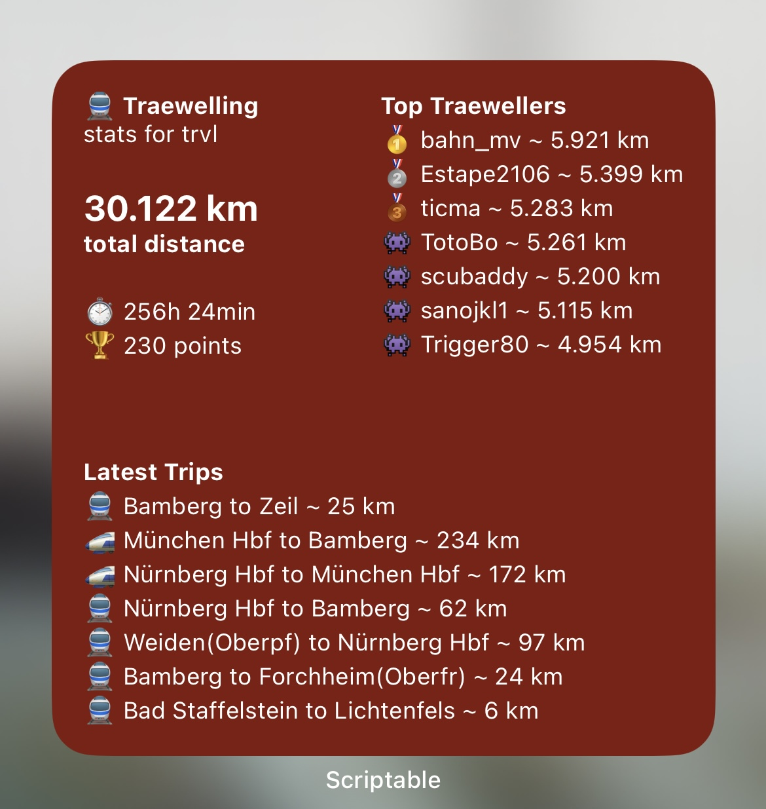

# Traewelling Global Widget

## Requirements
- iOS 14
- [Scriptable App](https://scriptable.app/) (free)
- [Traewelling account](https://traewelling.de) (free)

## Installation

## Features
- Will show you your total distance, total duration spent in trains and your total points
- Will show the top traewellers by distance (with a medium widget)
- Will show your latest public check ins (with a large widget)

## Preview
### Small Widget

### Medium Widget

### Large Widget

## License

